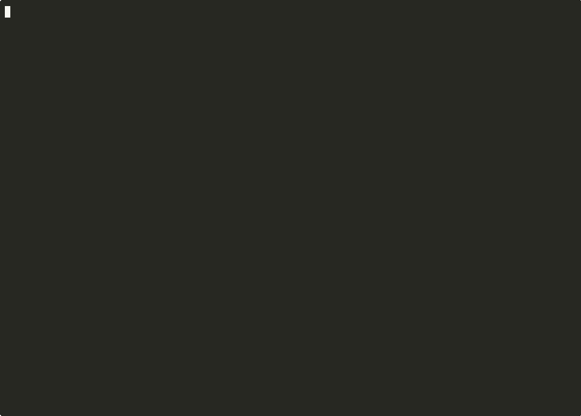

# Ritual Local Testbed

[](https://github.com/stevan-99/ritual-local-testbed/actions)
[](./LICENSE)
[](https://github.com/stevan-99/ritual-local-testbed)

> **Why this exists:** a local Ritual chain (chain 1979) so you can build
> Persistent Agent dApps while the public RPC is unreachable. Background,
> evidence and roadmap: [PITCH.md](./PITCH.md)

**A local Ritual Chain (chain-id `1979`) with mock system contracts and the
official Persistent Agent pipeline running end-to-end** — no public testnet
RPC required.

The public RPC endpoint (`rpc.ritualfoundation.org`) was not reliably
reachable at the time of writing. This testbed gives you a fully working
local equivalent so you can build, debug, and demo Ritual dApps **now**:
the unmodified official consumer contract, the unmodified official request
encoders, and the official Phase-2 poller, wired against a local anvil.

## Contents

- [What's in it](#whats-in-it)
- [Quick start](#quick-start)
  - [Make](#make)
  - [Docker](#docker)
  - [Step by step](#step-by-step)
- [Expected output](#expected-output)
- [Autonomous Trading Desk](#autonomous-trading-desk-example-dapp)
- [Mock framework](#mock-framework--the-agent-response-is-data)
- [Replay harness](#replay-harness--record-once-re-drive-forever)
- [Demo](#demo)
- [Canonical addresses](#canonical-addresses-mocked)
- [What's real vs. mocked](#whats-real-vs-mocked)
- [Env vars](#env-vars)
- [Notes / gotchas](#notes--gotchas)
- [Contributing](#contributing)
- [License](#license)

## What's in it

| Piece | What it is |
|---|---|
| `src/PersistentAgentConsumer.sol` | The **unmodified official** consumer contract from the Ritual skills pack — handles `callDKMSKey`, `callPersistentAgent`, and the `onPersistentAgentResult` callback (gated to `msg.sender == ASYNC_DELIVERY`). |
| `src/Mocks.sol` | Mock system contracts placed (via `anvil_setCode`) on the canonical Ritual addresses. Three of them are **generic** — `MockSyncGeneric`, `MockShortAsyncGeneric`, `MockLongRunningGeneric` — so a new precompile mock is a manifest entry, not a contract. |
| `scripts/helpers.py` | The **unmodified official** request builder + Phase-2 poller from the Ritual skills pack. |
| `scripts/deploy_mocks.py` | Deploys each mock and patches its bytecode onto the canonical address. |
| `scripts/e2e.py` | Full end-to-end: deploy consumer → DKMS flow → spawn persistent agent → poll Phase-2 → verify on-chain state. |
| `src/AutonomousTradingDesk.sol` | **Example dApp built on the testbed.** A persistent-agent consumer whose on-chain **risk gate** clamps every agent proposal before it becomes a trade intent. |
| `scripts/desk_e2e.py` | Desk E2E: unauthorized-callback guard, oversized/wrong-direction/malformed agent proposals, and the happy path — all asserted on-chain. |
| `mocks/*.json` | **Mock manifests.** Declare the mock set, the canonical addresses, and the agent payload — no Solidity needed to change what the agent returns. |
| `mocks/payloads/*.json` | **Agent payloads.** The response the mock agent delivers, as `abi_types` + `values`. |
| `scripts/replay_record.py` | Record a chain session (local or live) into a replay file. |
| `scripts/replay_run.py` | Replay a recording locally (exact mode) or diff the current build against a golden recording (regression mode). |
| `scripts/demo.sh` | Narrated one-command demo of all three pipelines. |
| `scripts/anvil_ctl.sh` | One anvil lifecycle for make, CI and Docker: detached start, RPC readiness poll (no fixed sleep), in-place `anvil_reset` to genesis, deployer funding. |
| `src/PrecompileZoo.sol` | **Example dApp using precompiles other than 0x0820** — JQ (sync), HTTP + LLM (short async), long-running HTTP + Image (long async). |
| `scripts/zoo_e2e.py` | Zoo E2E: 20 assertions across all three execution models, including two distinct Phase-2 callback selectors. |
| `mocks/zoo.json` | A manifest that stands in for five precompiles at once. |
| `replay/*-golden.json` | The committed golden recordings CI diffs every build against — one per pipeline (`desk`, `persistent`, `zoo`). |
| `docs/demo.gif` / `docs/demo.cast` | Terminal recording of the demo, and the asciicast it was rendered from. |

## Quick start

### Toolchain

Foundry is pinned to **1.8.4** (`Dockerfile`, and the same version in CI). The
source carries `forge-lint` suppressions for lint IDs that exist only from 1.8
onward, so on an older `forge` you will see `warning: unknown id: 'empty-block'`
(and similar) — those are the *older* forge not recognising the ID, not a
finding. Build output is clean on the pinned version: zero solc warnings, zero
lint findings.

```bash
# match the pin exactly
foundryup --install 1.8.4
```

### Make

```bash
# One-shot: deps, build, fresh anvil, fund, deploy mocks, run E2E.
make all

# All three pipelines (persistent agent + trading desk + precompile zoo).
make all-desk

# Narrated demo — starts its own anvil, walks the pipelines.
make demo

# Regression gate: diff the current build against the golden recordings.
make replay-goldens

# Re-record the goldens. Each recording needs a chain at genesis, which
# `anvil-fresh` does in place — no process restart, works non-interactively.
make record-goldens

# Verify the recorder itself without churning the committed goldens.
make record-goldens GOLDEN_DIR=/tmp/scratch
```

### Docker

```bash
# One-command environment: build image, run the full pipeline.
docker build -t ritual-local-testbed .
docker run --rm -e OPENROUTER_API_KEY=*** ritual-local-testbed
```

The entrypoint spins a fresh anvil (chain 1979) via `scripts/anvil_ctl.sh`, funds
the deployer derived from `PRIVATE_KEY`, deploys the six mocks, and runs the E2E
driver.

### Step by step

```bash
make deps build
make anvil              # start anvil on chain-id 1979 (detached, readiness-checked)
make anvil-fresh        # ...and reset it to genesis with the deployer funded
make anvil-status       # is it up, and at which block
make down               # stop it
make deploy-mocks       # deploys + patches the six mocks
make e2e                # runs the full pipeline
```

## Expected output

```
[1] Official PersistentAgentConsumer deployed: 0x...
[2a] Official executor discovery -> 0x0000...0001
[2b] callDKMSKey tx: 0x...
[2c] Child DKMS payment address: 0x...
[2d] Child DKMS pubkey: 0x...
[3a] Official request built: provider=openrouter model=... runtime=zeroclaw
[3b] callPersistentAgent tx: 0x...
[4a] Phase-2 delivered. jobId=0x...
[4b] official poll_phase2 ...
PHASE2_SECONDS=0.0
INSTANCE_ID=mock-instance-0001
GATEWAY_URL=http://127.0.0.1:8642/gateway
CONTAINER_ID=mock-container-7f3a
CHECKPOINT_CID=bafybeigdyrmockcheckpoint...
ERROR_MESSAGE=
GATEWAY_TOKEN=***
[5] lastJobId():   0x...
[5] lastResult():  ('mock-instance-0001', ...)

E2E PASSED: official consumer + official encoders + official Phase-2 poller
on chain 1979 (local anvil).
```

CI runs this exact pipeline on every push/PR
([`.github/workflows/ci.yml`](.github/workflows/ci.yml)).

## Autonomous Trading Desk (example dApp)

The repo ships one worked example so the testbed is not just plumbing: an
agent proposes a trade, and a **real on-chain risk gate** decides whether that
proposal may become an intent.

```
agent (TEE) --decision--> 0x0820 --> AsyncDelivery --> desk callback
                                                          |
                                                          v
                                    riskGate(): cap / leverage / confidence
                                                / direction / pair
                                                          |
                                                          v
                                            accept  -> TradeIntent recorded
                                            reject  -> HOLD + reason recorded
```

The gate is ordinary Solidity — the part that genuinely must be trustless:

| Limit | Rejects when |
|---|---|
| `maxNotionalUsd` | proposed notional exceeds the cap |
| `maxLeverage` | leverage outside `1..maxLeverage` |
| `minConfidenceBps` | agent confidence below the floor |
| `longOnly` | agent proposes a short on a long-only desk |
| `pair` | decision pair does not match the desk's pair |

Two behaviours worth noting:

* **Clamping, not reverting.** A rejected proposal still records a `TradeIntent`
  with the action forced to `HOLD` and a human-readable `riskReason`. The desk
  keeps an auditable trail of what it refused and why.
* **Containment.** A malformed payload emits `DecodeFailed` and returns instead
  of reverting, so one bad agent response cannot brick the desk (and cannot
  block the delivery path).

Run it:

```bash
make all-desk          # both pipelines on a fresh anvil
# or against a running anvil:
make desk-mocks        # put MockTradingAgent at 0x0820
make desk-e2e
```

`desk_e2e.py` asserts, on-chain: the unauthorized-callback guard reverts, an
oversized long is rejected as `notional above cap` and clamped to `HOLD`, a
compliant long is accepted as `LONG`, a short on a long-only desk is rejected,
and a malformed payload from the *real* AsyncDelivery address (impersonated via
anvil) is contained without recording an intent.

## Mock framework — the agent response is data

The mock agent that stands in for the `0x0820` precompile does not hard-code a
reply. It holds a payload, and the payload is configured from a **manifest**.
Changing what "the agent" returns is a JSON edit, not a Solidity edit — which
is the whole point, because every project needs a different agent response.

```bash
make deploy-mocks                                  # mocks/persistent.json (default)
make deploy-mocks MANIFEST=mocks/trading.json      # the desk's agent
make deploy-mocks MANIFEST=mocks/example-custom.json
```

A manifest names the mock set, the canonical address each one patches, and how
to initialise the agent:

```json
{ "name": "MockAgentGeneric", "address": "0x0000000000000000000000000000000000000820",
  "init": { "payload_file": "mocks/payloads/trading-decision.json" } }
```

and a payload file declares the ABI shape directly:

```json
{ "abi_types": ["string", "int8", "uint16", "uint256", "uint16", "string"],
  "values":    ["ETH/USD", 1, 7500, 1500000000, 3, "20d-high breakout"] }
```

**Adding your own agent response — three steps, no Solidity:**

1. copy `mocks/payloads/trading-decision.json`, edit `abi_types` + `values`
2. copy `mocks/example-custom.json`, point `payload_file` at your file
3. `make deploy-mocks MANIFEST=mocks/your-manifest.json`

Mixed types are supported and verified: `int8`, `uint16`, `uint256`, `string`,
`bytes`, `bool` all round-trip through the generic agent.

## Precompile mocks — any precompile, not just the agent

The persistent agent is one precompile out of sixteen. The mock framework covers
all three Ritual execution models with three generic contracts, so mocking a
precompile is a **manifest entry**, never new Solidity:

| Execution model | Mock contract | Configured by |
|---|---|---|
| sync — inline result | `MockSyncGeneric` | `response_file` |
| short async — `abi.encode(simmedInput, actualOutput)` | `MockShortAsyncGeneric` | `response_file` |
| long async — Phase 1 handle, Phase 2 via AsyncDelivery | `MockLongRunningGeneric` | `payload_file` + `layout` + `job_id` |

Long-running precompiles each put `deliveryTarget` and `deliverySelector` at a
**different head-word**, so the offsets are configuration:

```json
{
  "name": "MockLongRunningGeneric",
  "address": "0x0000000000000000000000000000000000000805",
  "init": {
    "payload_file": "mocks/payloads/zoo-long-http.json",
    "job_id": "0x91453dd6…",
    "layout": { "target_word": 8, "selector_word": 9, "launch_as_string": true }
  }
}
```

That last field is the important one. The mock reads the **declared**
`deliverySelector` out of the request and registers it with the delivery
contract, so a consumer's callback is whatever it declared — `onLongResult`,
`onImageResult`, anything. It is not hardcoded to the persistent-agent callback.

`mocks/zoo.json` mocks five precompiles at once and `make zoo-e2e` asserts all of
them:

| # | Precompile | Model | What is asserted |
|---|---|---|---|
| 1 | JQ `0x0803` | sync | returns the configured `uint256` inline |
| 2 | HTTP `0x0801` | short async | configured status + body, envelope unwrapped |
| 3 | LLM `0x0802` | short async | configured completion, `StorageRef` history tuple decoded |
| 4 | LR-HTTP `0x0805` | long async | Phase 1 task id, Phase 2 delivered via `onLongResult` |
| 5 | Image `0x0818` | long async | Phase 2 delivered via a **different** selector, `onImageResult` |

Word indices for every precompile are tabulated in the Ritual precompile ABI
reference; the ones exercised here are `0x0820`→6/7, `0x0805`→8/9, `0x0818`→8/9.

```bash
make zoo-mocks && make zoo-e2e
```

## Replay harness — record once, re-drive forever

Two modes, and they prove different things. Worth being precise about which is
which:

| Mode | Command | What it proves |
|---|---|---|
| Exact replay | `make replay FILE=replay/full-session.json` | The recording is self-contained and the chain reproduces it transaction-for-transaction. **It re-sends recorded bytecode, so a change under `src/` is invisible to it.** |
| Golden regression | `make replay-golden` | The **current build** emits the same events as the golden recording. This is the one that catches source regressions. |

```bash
# record a full session from a fresh chain (deterministic: sees everything)
make replay-record LABEL="desk session"

# re-drive it on a clean chain — no private key needed
make replay FILE=replay/session.json

# regression gate for one pipeline (RUN=desk|persistent|zoo)
make replay-golden RUN=persistent

# all three at once — this is what CI runs
make replay-goldens
```

**Three goldens, one per pipeline**, so a regression in any of them fails CI:

| `RUN=` | Script | Golden | Volatile events |
|---|---|---|---|
| `desk` | `desk_e2e.py` | `replay/desk-golden.json` | `PrecompileCalled` |
| `persistent` | `e2e.py` | `replay/persistent-golden.json` | `PrecompileCalled` |
| `zoo` | `zoo_e2e.py` | `replay/zoo-golden.json` | none — every zoo result is static manifest data |

Volatile means: the signature is still asserted, only the payload comparison is
skipped. Nothing else is loosened.

Recording a golden is `make record-golden RUN=<pipeline>` (or
`make record-goldens` for all three). Both compute the run window from the
current head, so **each recording needs a fresh chain** — otherwise the previous
run's transactions fall inside the next recording and it can never match.

That reset is in-place (`anvil_reset`), not a process restart, so `record-goldens`
runs to completion in a single non-interactive invocation.

Recorded transactions store a **window-relative `block_offset`, not an absolute
block number**. The comparison is positional anyway, but storing absolute blocks
meant every re-record rewrote hundreds of lines that carry no meaning — a real
change was indistinguishable from offset churn. With offsets, re-recording the
same session produces a diff you can actually read:

| pipeline | what changes between two recordings of the same commit |
|---|---|
| `zoo` | `recorded_at` only — fully reproducible |
| `desk`, `persistent` | `recorded_at`, plus `input`/`hash`/`gas_used` on the precompile txs — the ECIES request re-encrypts with a fresh ephemeral key each run, which is the same nondeterminism `PrecompileCalled` is declared volatile for |

If a golden diff ever contains anything *other* than those, it is a real change.

### The gate is verified, not assumed

A gate that is always green proves nothing, so it was tested by injecting a
regression the E2E script does *not* assert — a duplicate `SelectorSet` emit:

```
[4] 4/6 golden transactions reproduced
REGRESSION DETECTED against the golden recording:
  - tx[4] event signatures 4 -> 5 (first diff at #1)
```

The zoo script still passed; only the golden caught it. That is the coverage it
adds on top of the assertions.

How replication works, and the three non-obvious problems it solves:

- **Mock placement is RPC, not a transaction.** `anvil_setCode` leaves no trace
  in a block scan, so the recorder also captures the runtime code sitting at
  each canonical address and the replayer re-applies it.
- **Nonces are recorded and re-sent.** Without an explicit nonce, re-applying a
  manifest double-counts and every `CREATE` lands on a different address.
- **Volatile events are declared, not ignored.** `PrecompileCalled` embeds the
  ECIES-encrypted request, which uses a fresh ephemeral key per run, so its
  payload legitimately differs. Rather than quietly loosening the comparison,
  the recording declares it: signature still asserted, payload not compared.

Replay uses `anvil_impersonateAccount`, so a recording taken against a live
chain replays locally **without the original private keys**.

The harness is verified to actually detect drift, not just pass: removing a
single `emit` from the desk (leaving all logic intact, so the E2E itself still
passes) makes `make replay-goldens` fail with
`tx[3] event signatures 3 -> 2`.

## Demo



```bash
make demo          # starts its own anvil and walks both pipelines
```

The recording above is committed at `docs/demo.cast` and can be replayed with
`asciinema play docs/demo.cast`.

## Canonical addresses (mocked)

| Address | Contract |
|---|---|
| `0x9644e8562cE0Fe12b4deeC4163c064A8862Bf47F` | TEEServiceRegistry |
| `0x532F0dF0896F353d8C3DD8cc134e8129DA2a3948` | RitualWallet |
| `0xC069FFCa0389f44eCA2C626e55491b0ab045AEF5` | AsyncJobTracker |
| `0x5A16214fF555848411544b005f7Ac063742f39F6` | AsyncDelivery |
| `0x000000000000000000000000000000000000081B` | DKMS key precompile |
| `0x0000000000000000000000000000000000000820` | Persistent Agent precompile (`--agent persistent` or `trading`) |

## What's real vs. mocked

| Real (unmodified) | Mocked |
|---|---|
| Official consumer contract, deployed | TEE executor (`0x0820`) |
| Official 26-field request encoder | DKMS precompile (`0x081B`) |
| Official ECIES secret encryption | TEEServiceRegistry / RitualWallet / AsyncJobTracker / AsyncDelivery |
| Official Phase-2 poller | Live LLM inference, live DA, live container spawn |

Everything on the **developer-controlled side** (encoding, signing, callback
auth, polling) is the genuine Ritual code. The mocks replace only the on-chain
precompiles and TEE infrastructure that require the live chain.

## Env vars

| Var | Default | Notes |
|---|---|---|
| `RPC_URL` | `http://127.0.0.1:8545` | Anvil endpoint. |
| `PRIVATE_KEY` | anvil account 0 key | Funded deployer key. |
| `OPENROUTER_API_KEY` | — | LLM provider key (required by `build-persistent-request`). |
| `HF_TOKEN` | — | Hugging Face repo token (used as the Data Availability provider in the default run). |
| `HF_REPO_ID` | — | DA repo `org/name`. |

See [`.env.example`](.env.example).

## Notes / gotchas

- **anvil leaks disk across hard kills.** `anvil` writes crash-state dumps to
  `~/.foundry/anvil/tmp/anvil-state-*`. A clean shutdown removes its own
  directory, but a force-killed anvil (`kill -9`, a killed CI step, a dropped
  SSH session) leaves it behind — and they are ~2-3 MB *per block*, so a
  long-lived testbed can reach tens of GB. If the disk fills, run
  `make clean-anvil-state` (18 GB reclaimed in one case on this machine).

- **Gas:** the consumer's call into `0x0820` plus the nested
  `0x0820 → AsyncDelivery → consumer` callback needs ~490k gas. Set the
  top-level tx gas limit to ≥ 500k (the scripts use 2.5M).
- **DKMS result on anvil:** anvil receipts lack the Ritual `spcCalls`
  extension, so `e2e.py` reads the DKMS result from the consumer's
  `DkmsKeyResult(bytes)` event instead of `helpers.poll_dkms`.
- **Phase-2 jobId:** `helpers.poll_phase2` filters the
  `PersistentAgentResultDelivered` event by `jobId == txHash`. The mock
  precompile emits its own deterministic jobId (cheat-code `vm.getTxHash`
  doesn't apply to live RPC), so `e2e.py` feeds the actually-emitted jobId to
  the official poller.
- **One async commitment per sender per block:** the mock
  `AsyncJobTracker.senderPreEnabled` returns `true` and `hasPendingJobForSender`
  returns `false` to keep the testbed single-shot.
- **Python 3.14:** `coincurve` must build from source on 3.14; a 3.10–3.12
  venv is the smooth path.

## Contributing

See [CONTRIBUTING.md](CONTRIBUTING.md). The short version: keep the official
files byte-identical to upstream, keep chain-id 1979, and **CI must stay
green** — it runs the full E2E on every push/PR.

## License

MIT. The official consumer contract and helpers are vendored unmodified from
the Ritual Foundation skills pack.
